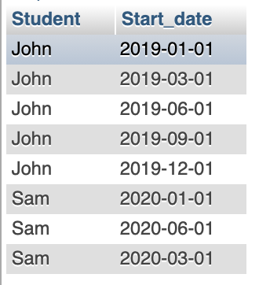
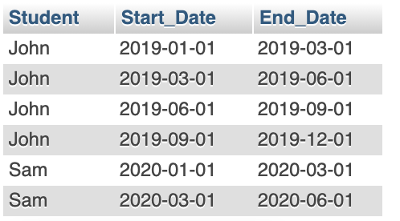

#### Questions: 
In this question, I have a table "Course", with column student, and start_date. Since each start_date is the older end_date.   
Please return a query to me with column like student, start_date, end_date.   
<br/>   
   
Original...

| | Course | 
| -- | -- |
| John | 2019-01-01 |
| John | 2019-03-01 |
| John | 2019-06-01 |
| John | 2019-09-01 |
| John | 2019-12-01 |
| Sam' | 020-01-01 |
| Sam' | 020-06-01 |
| Sam' | 020-03-01 |

Return...
| | Course | |
| -- | -- | -- |
| John | 2019-01-01 | 2019-03-01 |
| John | 2019-03-01 | 2019-06-01 |
| John | 2019-06-01 | 2019-00-01 |
| John | 2019-09-01 | 2019-12-01 |
| John | 2019-12-01 | Null |
| Sam' | 020-01-01 | 2019-03-01 |
| Sam' | 020-03-01 | 2019-06-01 |
| Sam' | 020-06-01 | Null |


```sql
-- Solution 01

CREATE TABLE Course (
    Student VARCHAR(20), 
    Start_date Date
);

INSERT INTO Course 
VALUES 
  ('John', '2019-01-01'), 
  ('John', '2019-03-01'), 
  ('John', '2019-06-01'), 
  ('John', '2019-09-01'), 
  ('John', '2019-12-01'), 
  ('Sam', '2020-01-01'), 
  ('Sam', '2020-06-01'), 
  ('Sam', '2020-03-01')
;
SELECT * 
FROM Course
```


```sql
WITH cte AS (SELECT 
  Student, Start_Date,  
  ROW_NUMBER () OVER (PARTITION BY Student ORDER BY Start_Date) AS R 
FROM Course) 

SELECT 
  c1.Student, c1.Start_Date, c2.Start_Date as End_Date
FROM cte c1
JOIN (
SELECT 
 Student, Start_Date, R-1 as R
FROM cte
WHERE R>0) c2
ON c1.Student = c2.Student and c1.R = c2.R
;
```


<br/>  
```sql
-- Solution 2: LEAD
SELECT 
    Student,
    Start_date,
    LEAD(Start_date,1) OVER (
        PARTITION BY Student
        ORDER BY Start_date ) AS End_Date
FROM Course
;
```
